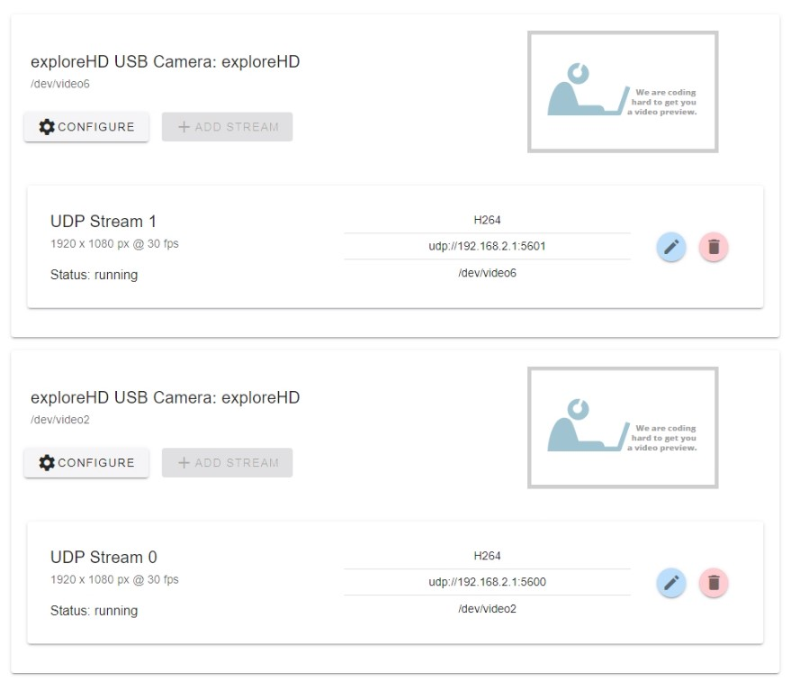

# ArduSub Companion Setup for exploreHD
## Streaming from ArduSub Companion
```{note} **As of November 20, 2021, all exploreHD/HDCam shipped will feature a new firmware that allows the cameras to be plug and play with ArduSub Companion without the need for drivers.**

If you notice the video stream is very sluggish, your exploreHD/HDCam may be on an outdated firmware. Click [here](https://docs.exploredeepwater.com/software/firmware.html) to update the firmware.
```
If you have multiple exploreHDs and you would like to stream them simultaneously, you can use the new [ArduSub Companion 1.0 BETA](https://docs.bluerobotics.com/ardusub-zola/software/companion/1.0/). 



```{note}When setting up streams, make sure the udp:// is set to 192.168.2.1:560*

Change * to a number for different streams
```

## Receiving Multiple Streams
See our [modified version of QGround Control](https://docs.exploredeepwater.com/software/qgroundcontrol.html). 


Pipeline to use for receiving stream in OBS (Open Broadcaster Software)

`udpsrc port=5600 ! application/x-rtp,media=(string)video,clock-rate=(int)90000,encoding-name=(string)H264 ! rtph264depay ! avdec_h264 output-corrupt=false ! videoconvert ! video. `