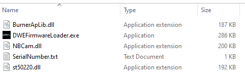
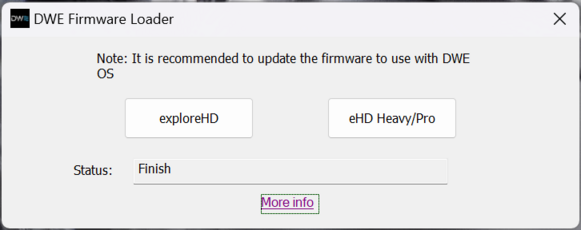
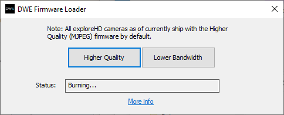
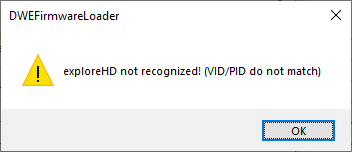
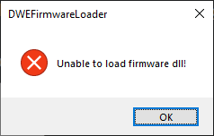

# DWE Firmware Loader

## Procedure for Updating exploreHD/HDCam Firmware

### Step 1

Extract the zip file containing the folder with the program.




### Step 2

Plug in **one** exploreHD camera.

### Step 3

**Make sure all applications that use the camera are closed before proceeding.**

Run *DWEFirmwareLoader.exe*



### Step 4

Click on the firmware version that you would like to use.

* **Higher Quality** provides higher quality video, but uses more bandwidth.
    * Reccomended for use with a single exploreHD.

* **Lower Bandwidth** uses less bandwidth, but provides lower quality video.
    * Reccomended for use in a setup with multiple exploreHDs.

```{warning} Do not close the application, unplug the camera, or open any applications that may use the camera until the update is complete.
```



### Step 5

After approximately a minute, the exploreHD should have the new firmware loaded and ready to use!

You may now close the application. You can test the camera using any camera application for Windows. If everything looks good, you are ready to use it on your ROV!

See: [Getting Started](../products/explorehd)

## Troubleshooting

If you see any errors during the upgrading process, please follow the guides below.

### Error: exploreHD not recognized!



1. Ensure the exploreHD is the only camera plugged in
2. If on a laptop, temporarily disable the built-in webcam by going to Device Manager.
3. Please ensure you have extracted everything in the zip file. The dll files must be in the same folder directory as the main exe.

### Error: Unable to load firmware dll!



1. Please ensure you have extracted everything in the zip file. The dll files must be in the same folder directory as the main exe.


## Procedure Video

```{warning} This video uses an outdated version of the loader and may not be accurate. Documentation for this version can be found [here](https://docs.exploredeepwater.com/legacy/firmware_legacy.html).
```

*There are some precautions to complete updating successfully. Please read the following instructions carefully.*

<iframe width="560" height="315" src="https://www.youtube.com/embed/G4h9EAG88HU" title="YouTube video player" frameborder="0" allow="accelerometer; autoplay; clipboard-write; encrypted-media; gyroscope; picture-in-picture" allowfullscreen></iframe>
