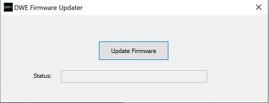
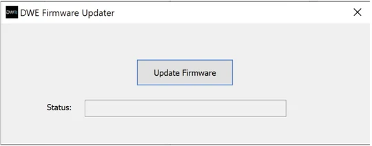
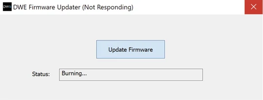

# DWE Firmware Updater

## 11/20/2021 exploreHD Update

```{note} This update is for cameras shipped before 11/20/2021. Any exploreHD shipped after that date does not need to be updated.
```

```{warning} This application is still in BETA. Please read all instructions before proceeding.
```



[**Download DWEFirmwareUpdater**](https://cdn.shopify.com/s/files/1/0575/8785/9626/files/DWEFirmwareUpdater.zip?v=1637819450)

## Procedure for Updating exploreHD/HDCam Firmware

*There are some precautions to complete updating successfully. Please read the following instructions carefully.*

<iframe width="560" height="315" src="https://www.youtube.com/embed/G4h9EAG88HU" title="YouTube video player" frameborder="0" allow="accelerometer; autoplay; clipboard-write; encrypted-media; gyroscope; picture-in-picture" allowfullscreen></iframe>

---

### Steps 1 & 2

Extract the zip file containing the folder with the program.

Plug in **one** exploreHD camera.


### Step 3

**Make sure all applications that use the camera are closed before proceeding.**

Run *DWEFirmwareUpdater.exe*



### Step 4

Click Update Firmware

It **is normal** for it to show "Not Responding".

```{warning} Do not close the application, unplug the camera, or open any applications that may use the camera until the update is complete.
```



### Step 5

After approximately a minute, the firmware should be updated on the exploreHD!

You may now close the application. You can test the camera using any camera application for Windows. If everything looks good, you are ready to use it on your ROV!

See: [Getting Started](../products/explorehd)

## Troubleshooting

If you see any errors during the upgrading process, please follow the guides below.

### Error: exploreHD not recognized!

1. Ensure the exploreHD is the only camera plugged in
2. If on a laptop, temporarily disable the built-in webcam by going to Device Manager.
3. Please ensure you have extracted everything in the zip file. The dll files must be in the same folder directory as the main exe.

### Error: Unable to load firmware dll!

1. Please ensure you have extracted everything in the zip file. The dll files must be in the same folder directory as the main exe.


