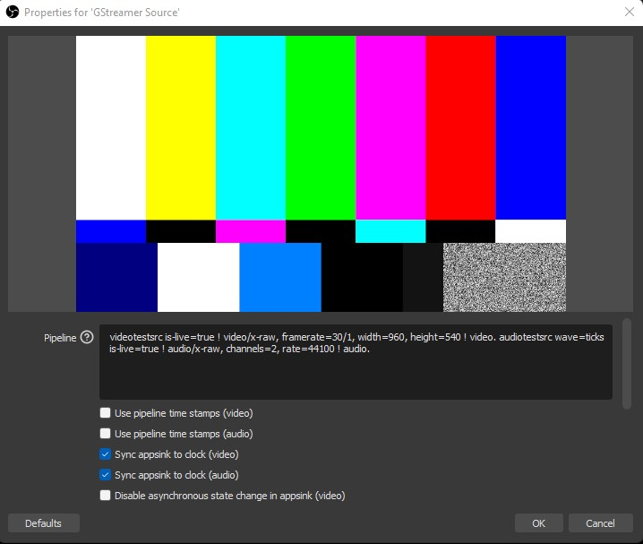
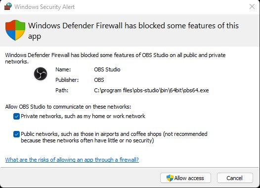

# OBS (Open Broadcasting Software)
To view the multiple streams in OBS, you will need to install OBS, GStreamer, and the OBS GStreamer plugin on your PC.

## Installing OBS

[Click here to download the latest version of OBS](https://obsproject.com/download)

## Installing GStreamer

To install GStreamer on Windows, check out the link below.

[Install GStreamer for Windows Instructions](/guides/pi_setup.html#step-10-install-gstreamer)

## Installing OBS Gstreamer Plugin

Download the plugin [here](https://github.com/fzwoch/obs-gstreamer/releases/tag/v0.3.3).

Place the `obs-gstreamer.dll` in the `obs-plugins\64bit` folder of the root directory

In this example, it's `C:\Program Files\obs-studio\obs-plugins\64bit`

After this, you are done with the initial setup!

## Setting up the Stream in OBS

After opening OBS, you want to add a GStreamer Source.

You should be prompted with a window like this

In the pipeline, use,

`udpsrc port=5600 ! application/x-rtp,media=(string)video,clock-rate=(int)90000,encoding-name=(string)H264 ! rtph264depay ! avdec_h264 output-corrupt=false ! videoconvert ! video.`

You will be prompted with the following window. Please enable OBS for both private and public networks.

After that, you should see a video stream! If you don't, make sure your port number is correct on both the receiving and streaming ends.

**To View Multiple Streams**

Add another GStreamer Source in the Sources Window

Use the same pipeline but change the port to what you set your streaming port to. In our example it's `5601`

`udpsrc port=5601 ! application/x-rtp,media=(string)video,clock-rate=(int)90000,encoding-name=(string)H264 ! rtph264depay ! avdec_h264 output-corrupt=false ! videoconvert ! video. `

Another stream should show up on the main window of OBS. Click on the video display to resize to your preference. 

Below is an example of a setup with viewing 3 exploreHDs at the same time using OBS!

**Recording/Streaming Settings**

Given each camera is set to 10Mb/s as the default bitrate, the streaming and recording should match that. In the case of 3 cameras, providing at least 30Mb/s of streaming and recording bitrate should provide you with high quality. 

**Limitation with this Setup**

With a 3 stream setup, this configuration will rely on a powerful GPU to run the videos smoothly. We found that OBS is a lot more intensive to run when compared to QGroundControl. Make sure your laptop is powerful enough to run it or you can lower the resolution of some of the streams to 720p.
