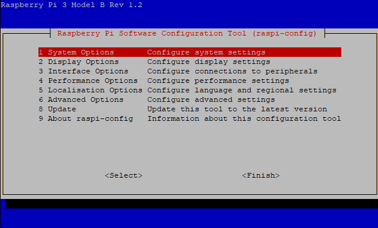
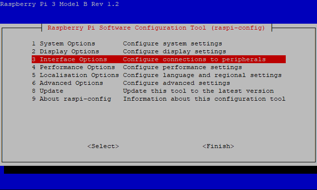
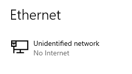
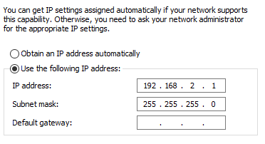
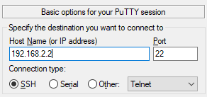
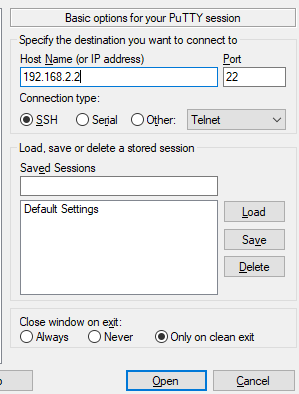
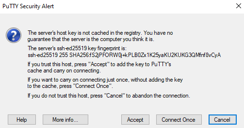
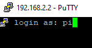
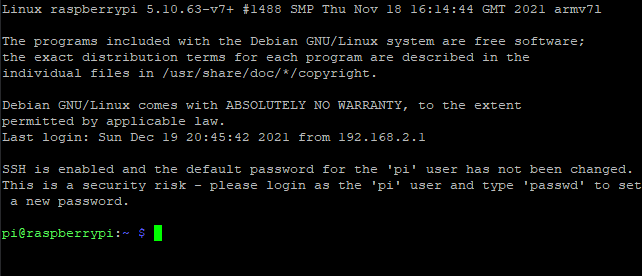

# Setting up Streaming from a Raspberry Pi

```{note} The following instructions are for if you want to setup streaming from a Raspberry Pi without ArduSub.
```

## Step 1: Flashing the Raspberry Pi

* Download and open the [Raspberry Pi Imager](https://www.raspberrypi.com/software/) from the official Raspberry Pi website
* If you haven't already, insert the SD card into your computer
* Select Raspberry Pi OS (32-bit) for the Operating System and the SD card you inserted as the SD card.
* Select `Write` to begin flashing the Operating System to the SD card

## Step 2: Powering

* Plug in a compatible HDMI cable and monitor to the Pi
* Connect a USB keyboard and mouse to the Pi
* Power the Pi using a micro usb or usb c power adapter depending on the version of Raspberry Pi you are using

```{important} Ensure you power the Pi after plugging the monitor in to the Pi **and wall power**, otherwise the Pi will not recognize the display and you will have to power cycle the device.
```

## Step 3: Perform the Initial Setup

* Setup the Pi with the GUI provided on start
* Ensure WiFi is connected as soon as possible

```{warning} Make sure you select the **US Keyboard layout** or some keys will not be recognized properly.
```

## Step 4: Set Static IP

* Edit dhcpcd.conf -  `sudo nano /etc/dhcpcd.conf`
* Add:
```
interface eth0
static ip_address=192.168.2.2/24
```
to the end of the file
* Save and close the file with ctrl-o, enter, and then ctrl-x

## Step 5: Connect to a Laptop

* Plug in an ethernet cable into the Raspberry Pi with the other end connected to a Windows or Linux laptop or PC
* Enable ssh on the pi

### Enabling SSH

* Run `sudo raspi-config`



* Select Interface Options (and press enter)



```{note} Use the arrow keys to navigate the menu up and down
```

* Under Interface Options, Select SSH


* Select `yes` and press enter


## Step 6: Reboot the Pi

* Run: `sudo reboot`

## Step 7: Configure Laptop Ethernet

### Windows

Under Settings/Network & Ethernet, select Ethernet


The following network should be available:



Under Related Settings, select `Change Adapter Options`


Find the adapter called `Ethernet` with the subtitle of `Unidentified Network`


Right click the selected adapter and click `properties`


Under properties, locate `Internet Protocol Version 4 (TCP/IPv4)`


Now select `Properties` and select the following settings:



Click `OK` to apply changes

## Step 8: SSH into the Pi

* From the connected Windows or Linux device, ssh into the Raspberry Pi

For Windows, we recommend using Putty which can be downloaded from [here](https://www.putty.org/)

* After installing, open Putty and type the address of the Raspberry Pi (192.168.2.2)



* Keep the other settings as default and click the `Open` button



* After connecting you will be prompted with a *security alert*. Ensure you select **accept**.



* To login use the following credentials: username: `pi`, password: `raspberry`




* You should be greeted with the following:



With Linux, you can use the builtin ssh client in terminal by running:
`ssh pi@192.168.2.2` with the same password as Windows (`raspberry`)

```{note} At this point you can disconnect the USB keyboard, mouse, and monitor from the Raspberry Pi.
```

## Step 9: Update the Pi

```
sudo apt-get update
sudo apt-get upgrade
sudo apt full-upgrade
sudo apt dist-upgrade
```

```{note} This process may take a while
```

## Step 10: Install GStreamer

### Windows Install

Download the gstreamer framework from here: [http://gstreamer.freedesktop.org/data/pkg/windows](http://gstreamer.freedesktop.org/data/pkg/windows). **Recommended version is 1.18.1**.

Downloads:

**32-bit:**
* [gstreamer-1.0-msvc-x86-1.18.1.msi](https://gstreamer.freedesktop.org/data/pkg/windows/1.18.1/msvc/gstreamer-1.0-msvc-x86-1.18.1.msi)

**64-bit:**
* [gstreamer-1.0-msvc-x86_64-1.18.1.msi](https://gstreamer.freedesktop.org/data/pkg/windows/1.18.1/msvc/gstreamer-1.0-msvc-x86_64-1.18.1.msi)

**If in doubt of which install to use, download the 64-bit version as this is more common.**

### Linux Install

*a different installation method is recommended for a Raspberry Pi*

Use apt-get to install GStreamer 1.0:

`list=$(apt-cache --names-only search ^gstreamer1.0-* | awk '{ print $1 }' | sed -e /-doc/d | grep -v gstreamer1.0-hybris)`

`sudo apt-get install $list`

### Raspberry Pi Install

Remove GStreamer:

`sudo apt-get remove libgstreamer* gstreamer1.0*`

Install GStreamer:

`sudo apt-get install gstreamer1.0-tools gstreamer1.0-x gstreamer1.0-plugins-base gstreamer1.0-plugins-good gstreamer1.0-plugins-bad`

## Step 11: Plug in the Camera

* Connect an exploreHD or HDCam to an available USB port on the Raspberry Pi

```{note}
See {doc}`exploreHD <../products/explorehd>` or {doc}`HDCam <../products/hdcam>` getting started guides
```

## Step 12: Run GStreamer

### Streaming

On the Raspberry Pi, run:

`gst-launch-1.0 -v v4l2src device=/dev/video1 ! video/x-h264, width=1920,height=1080! h264parse ! queue ! rtph264pay config-interval=10 pt=96 ! udpsink host=192.168.2.1 port=5600 sync=false`

to start streaming.

### Receiving

To receive the stream on a Windows or Linux laptop or PC run:

`gst-launch-1.0 udpsrc port=5600 ! application/x-rtp ! rtpjitterbuffer ! rtph264depay ! avdec_h264 ! videoconvert ! autovideosink`
